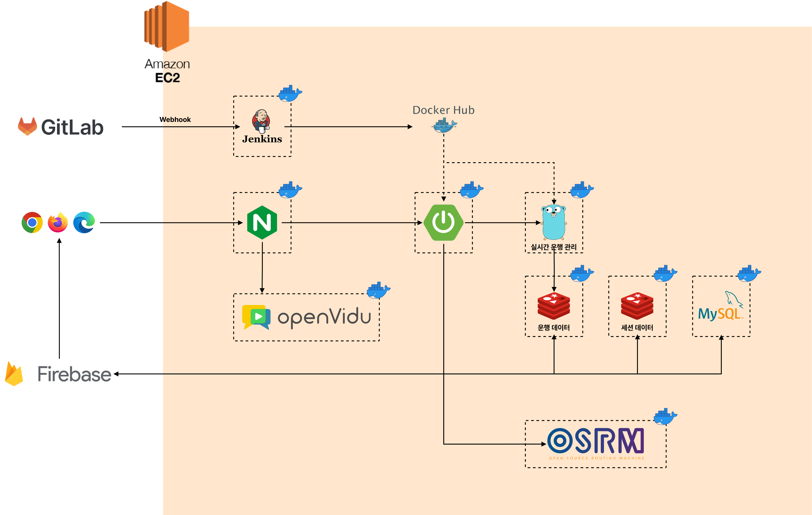

# 싸피 버스 지도, 싸버지  

> 프로젝트 진행 기간: 2023.07.10. ~ 2023.08.18.  

[📎 프로젝트 커밋 메시지 컨벤션](./docs/commit-message-convention.md)  

## 목차  

- [싸피 버스 지도, 싸버지](#싸피-버스-지도-싸버지)
  - [목차](#목차)
  - [프로젝트 개요](#프로젝트-개요)
  - [서비스 기능](#서비스-기능)
  - [팀원](#팀원)
    - [담당 업무](#담당-업무)
  - [서비스 아키텍처](#서비스-아키텍처)
  - [개발 환경](#개발-환경)

## 프로젝트 개요  

- 프로젝트 목표  
  - 싸피 교육생들의 셔틀 버스 사용 경험 개선  
- 프로젝트 배경  
  - 변동이 심한 셔틀버스 도착 시간으로 인한 이용 불편  
  - 하차지 패싱으로 인한 교육생과 버스 기사님과의 마찰 발생 문제  
- 기대 효과  
  - 실시간 버스 위치 추적 기능을 통한 셔틀버스 사용 경험 개선  
  - 버스 기사님에게 하차지 정보를 제공해 교육생과 버스 기사님과의 마찰 해소  

## [서비스 기능](./docs/features.md)  

[👀 모든 기능 자세히 둘러보기](./docs/features.md)  

- [1. 일반 사용자 기능](./docs/features.md#1-일반-사용자-기능)
  - [1.1. 로그인](./docs/features.md#11-로그인)
  - [1.2. 내 위치 및 버스 위치 조회](./docs/features.md#12-내-위치-및-버스-위치-조회)
  - [1.3. 셔틀버스 탑승을 위한 QR 코드 생성](./docs/features.md#13-셔틀버스-탑승을-위한-qr-코드-생성)
  - [1.4. 셔틀버스 운행 간의 불편 사항 신고](./docs/features.md#14-셔틀버스-운행-간의-불편-사항-신고)
- [2. 버스 기사 기능](./docs/features.md#2-버스-기사-기능)
  - [2.1. 버스 운행 시작/종료](./docs/features.md#21-버스-운행-시작종료)
  - [2.2. 버스 운행 상태 확인](./docs/features.md#22-버스-운행-상태-확인)
  - [2.3. 관리자와의 긴급 화상 통화](./docs/features.md#23-관리자와의-긴급-화상-통화)
  - [2.4. 사용자의 QR 코드 인식](./docs/features.md#24-사용자의-qr-코드-인식)
- [3. 관리자 기능](./docs/features.md#3-관리자-기능)
  - [3.1. 교육생 등록](./docs/features.md#31-교육생-등록)
  - [3.2. 교육생 조회 및 수정](./docs/features.md#32-교육생-조회-및-수정)
  - [3.3. 셔틀버스 노선 등록](./docs/features.md#33-셔틀버스-노선-등록)
  - [3.4. 셔틀버스 노선 조회 및 삭제](./docs/features.md#34-셔틀버스-노선-조회-및-삭제)
  - [3.5. 긴급 화상 통화](./docs/features.md#35-긴급-화상-통화)
  - [3.6. 셔틀버스 신고 조회](./docs/features.md#36-셔틀버스-신고-조회)

## 팀원  

| 팀장 기대성                                                                                                                                     | 김한결                                                                                                                                            | 권준일                                                                                                                                           | 방상제                                                                                                                                           | 이지헌                                                                                                                                          | 정호윤                                                                                                                                           |
| ----------------------------------------------------------------------------------------------------------------------------------------------- | ------------------------------------------------------------------------------------------------------------------------------------------------- | ------------------------------------------------------------------------------------------------------------------------------------------------ | ------------------------------------------------------------------------------------------------------------------------------------------------ | ----------------------------------------------------------------------------------------------------------------------------------------------- | ------------------------------------------------------------------------------------------------------------------------------------------------ |
|  |  |  |  |  |  |

### 담당 업무  

🙋🏻‍♂️ 기대성  

- 데이터베이스 스키마 설계  
- 서버 인프라 구성  
- 컨테이너 이미지 배포를 위한 Jenkins 파이프라인 작성  
- Spring Security JWT 인증 기능 구현  
- GPS 위치 데이터 보정 서비스 구현  
- 버스 운행 정보 관리 API 구현  
- OSRM을 사용한 노선 최적 경로 생성 HTTP API 작성  

🙋🏻‍♂️ 김한결  

- 데이터베이스 스키마 설계  
- 버스 CRUD API 구현  
- 버스 노선 CRUD API 구현  
- 버스 정류장 CRUD API 구현  
- 교육생 신고 CRUD API 구현  
- OpenVidu를 이용한 화상 통화 구현  

🙋🏻‍♂️ 권준일  

- 데이터베이스 스키마 설계  
- 회원 조회 API 구현  
- FCM을 이용한 알림 기능 구현  
- OpenVidu를 이용한 화상 통화 구현  
- 기술 탐구와 꼼꼼한 문서화로 팀 개발 능률 향상  

🙋🏻‍♂️ 방상제  

- 출/퇴근 탑승자별 QR 정보 생성 후 인식 및 전송  
- 관리자 페이지 회원 관리 기능 구현 및 디자인  
- 관리자 페이지 버스 노선 조회 기능 구현 및 디자인  
- 로그인 페이지 기능 구현 및 디자인  

🙋🏻‍♂️ 이지헌  

- PWA를 사용해 서비스의 접근성 향상  
- FCM을 이용한 푸시 알림 기능 구현  
- OpenVidu를 이용한 화상 통화 구현  
- 버스 기사 페이지 기능 구현 및 디자인  
- 교육생 메인 페이지 기능 구현 및 디자인  
- 교육생 신고 페이지 기능 구현 및 디자인  
- 관리자 신고 조회 페이지 기능 구현 및 디자인  

🙋🏻‍♂️ 정호윤  

- React-leaflet 라이브러리를 이용한 지도 화면 구현  
- 기기의 GPS 정보 기반 사용자 위치 파악 및 표시 기능 구현  
- react-beautiful-dnd 라이브러리를 이용하여 드래그 앤 드롭 리스트 구현  
- 드래그 앤 드롭 리스트와 지도 위 마커를 연동하여 경로 생성 기능 구현  
- 실시간 버스 위치 및 경로 표시 기능, 버스의 움직임에 따라 경로가 줄어드는 애니메이션 구현  

## 서비스 아키텍처  

## 개발 환경  

- Back-End
  - MySQL 8.1.0  
  - Redis 7.2  
  - OpenJDK 17.0.7  
  - Spring Boot 3.1.2  
    - Spring Security  
    - Spring Data JPA  
    - Spring Data Redis  
  - Go 1.21.0  
  - uber.go/fx 1.20.0  
  - gin 1.9.1  
- Front-End
  - React.js
  - Zustand
  - Tailwind CSS
  - react-leaflet
  - react-beautiful-dnd
- Other Dependencies  
  - FCM  
  - OSRM 5.27.1  
  - OpenVidu 2.28  
- Tools
  - Docker  
  - NGINX  
  - Jenkins  
  - Mattermost  
  - JIRA  
