# 서비스 기능  

- [서비스 기능](#서비스-기능)
  - [1. 일반 사용자 기능](#1-일반-사용자-기능)
    - [1.1. 로그인](#11-로그인)
    - [1.2. 내 위치 및 버스 위치 조회](#12-내-위치-및-버스-위치-조회)
    - [1.3. 셔틀버스 탑승을 위한 QR 코드 생성](#13-셔틀버스-탑승을-위한-qr-코드-생성)
    - [1.4. 셔틀버스 운행 간의 불편 사항 신고](#14-셔틀버스-운행-간의-불편-사항-신고)
  - [2. 버스 기사 기능](#2-버스-기사-기능)
    - [2.1. 버스 운행 시작/종료](#21-버스-운행-시작종료)
    - [2.2. 버스 운행 상태 확인](#22-버스-운행-상태-확인)
    - [2.3. 관리자와의 긴급 화상 통화](#23-관리자와의-긴급-화상-통화)
    - [2.4. 사용자의 QR 코드 인식](#24-사용자의-qr-코드-인식)
  - [3. 관리자 기능](#3-관리자-기능)
    - [3.1. 교육생 등록](#31-교육생-등록)
    - [3.2. 교육생 조회 및 수정](#32-교육생-조회-및-수정)
    - [3.3. 셔틀버스 노선 등록](#33-셔틀버스-노선-등록)
    - [3.4. 셔틀버스 노선 조회 및 삭제](#34-셔틀버스-노선-조회-및-삭제)
    - [3.5. 긴급 화상 통화](#35-긴급-화상-통화)
    - [3.6. 셔틀버스 신고 조회](#36-셔틀버스-신고-조회)

## 1. 일반 사용자 기능  

### 1.1. 로그인  

|                        로그인 화면                        |
| :-------------------------------------------------------: |
|  |

### 1.2. 내 위치 및 버스 위치 조회  

|                        메인 화면 1                        |                        메인 화면 2                        |                        메인 화면 3                        |
| :-------------------------------------------------------: | :-------------------------------------------------------: | :-------------------------------------------------------: |
| 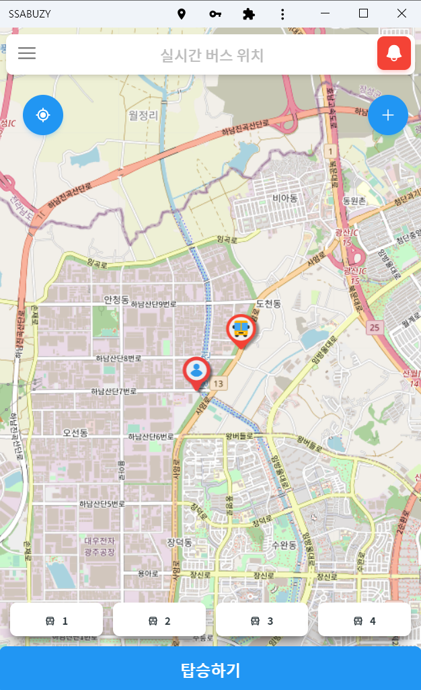 | 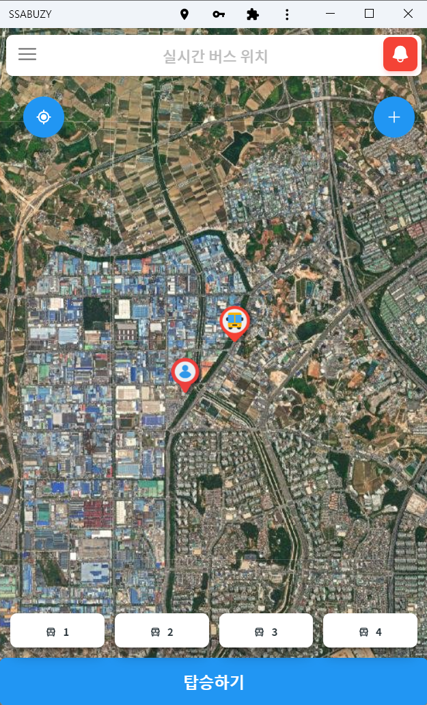 |  |

### 1.3. 셔틀버스 탑승을 위한 QR 코드 생성  

|                 버스 탑승 QR 코드 생성 화면                 |                  버스 탑승 QR 코드 화면                   |
| :---------------------------------------------------------: | :-------------------------------------------------------: |
|  | 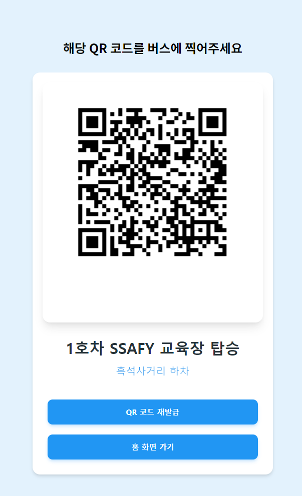 |

### 1.4. 셔틀버스 운행 간의 불편 사항 신고  

|                      신고 접수 화면                       |                    신고 접수 완료 화면                    |
| :-------------------------------------------------------: | :-------------------------------------------------------: |
| 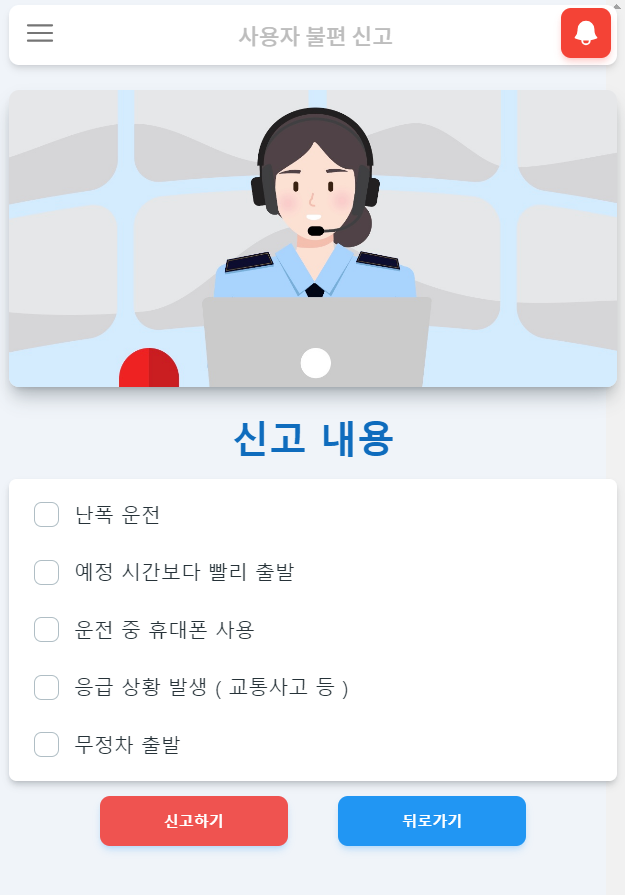 |  |

## 2. 버스 기사 기능  

### 2.1. 버스 운행 시작/종료  

|                       운행 시작 화면                        |                       운행 종료 화면                        |
| :---------------------------------------------------------: | :---------------------------------------------------------: |
| 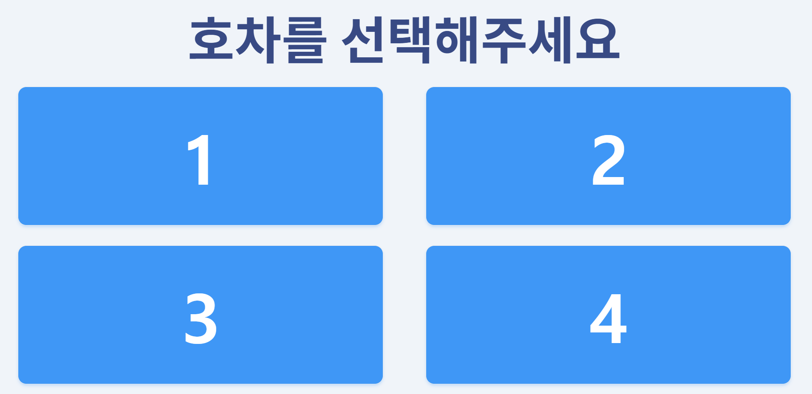 | 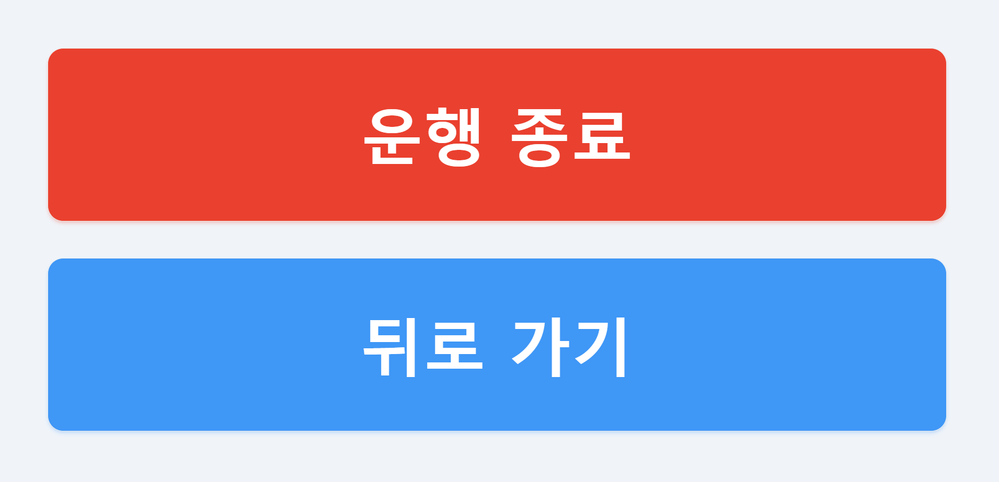 |

### 2.2. 버스 운행 상태 확인  

|                       운행 경로 화면                        |
| :---------------------------------------------------------: |
| 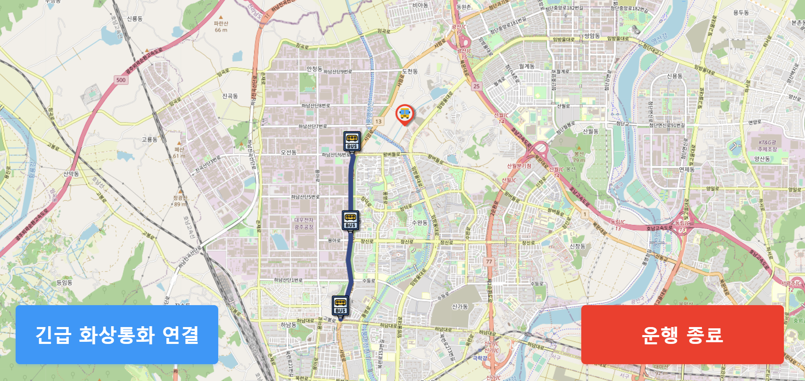 |

### 2.3. 관리자와의 긴급 화상 통화  

|                     긴급 화상 통화 화면                     |
| :---------------------------------------------------------: |
| 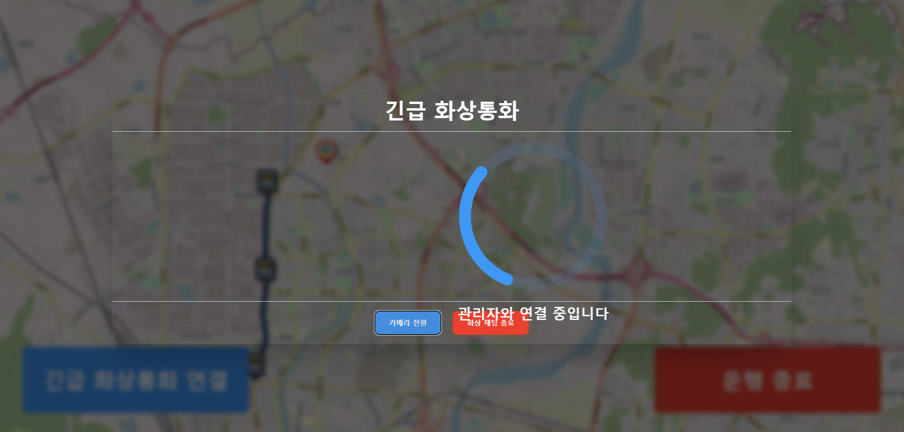 |

### 2.4. 사용자의 QR 코드 인식  

|                       QR 코드 인식 화면                       |
| :-----------------------------------------------------------: |
| 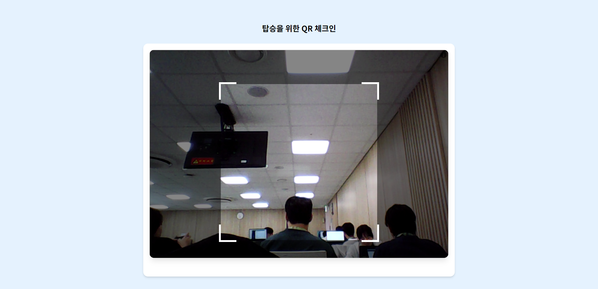 |

## 3. 관리자 기능  

### 3.1. 교육생 등록  

|                       교육생 등록 화면                       |
| :----------------------------------------------------------: |
| 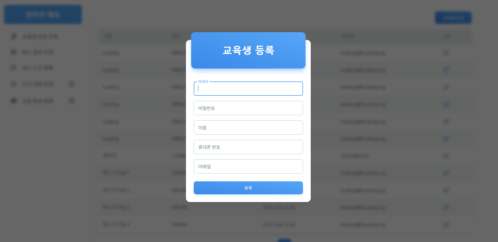 |

### 3.2. 교육생 조회 및 수정  

|                      교육생 조회 화면                      |
| :--------------------------------------------------------: |
| 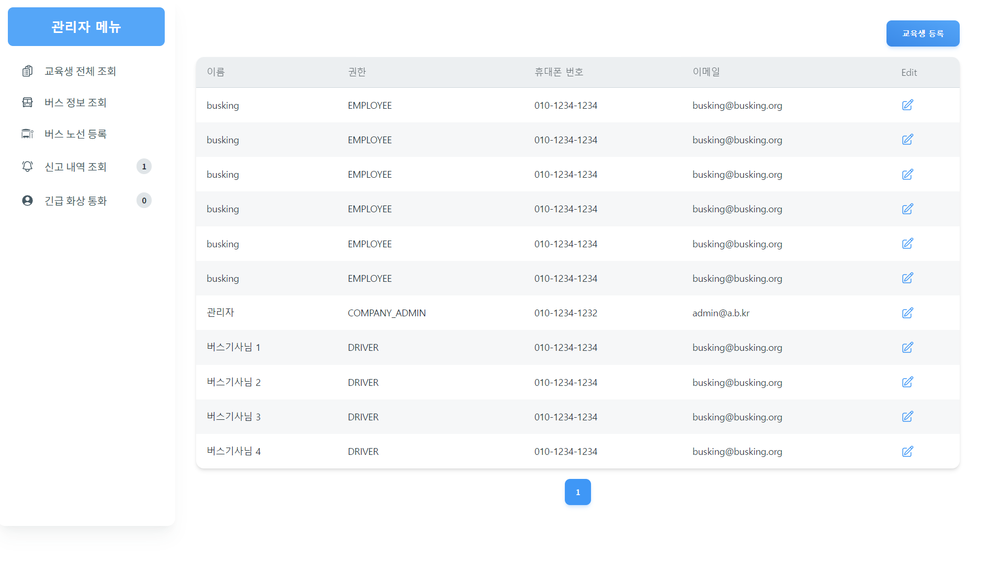 |

### 3.3. 셔틀버스 노선 등록  

|                   셔틀버스 노선 등록 화면                    |
| :----------------------------------------------------------: |
| 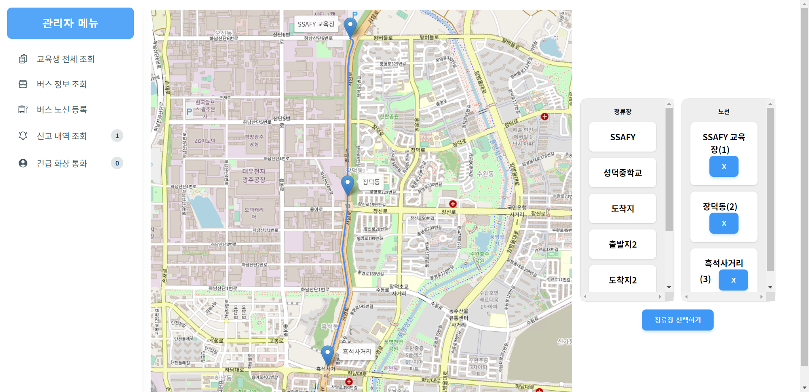 |

### 3.4. 셔틀버스 노선 조회 및 삭제  

|                   셔틀버스 노선 조회 화면                    |
| :----------------------------------------------------------: |
| 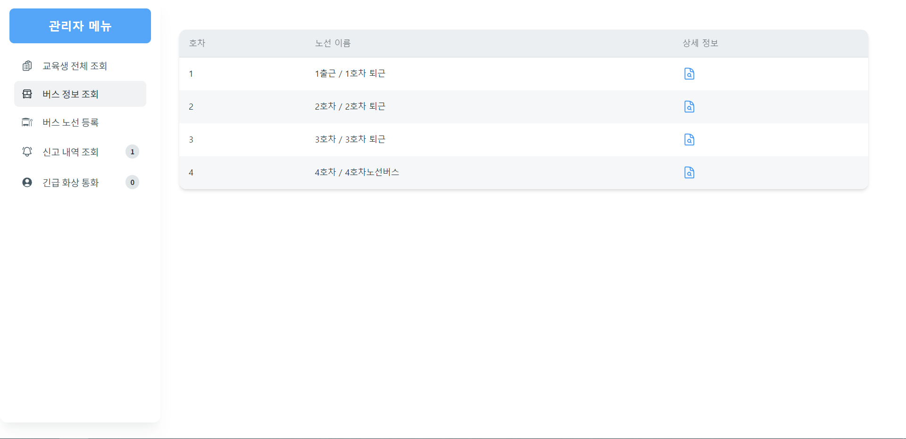 |

### 3.5. 긴급 화상 통화  

|                     긴급 화상통화 화면 1                     |                    긴급 화상 통화 화면 2                     |
| :----------------------------------------------------------: | :----------------------------------------------------------: |
| 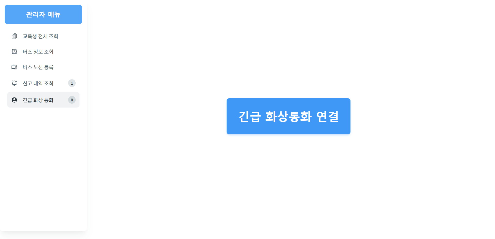 | 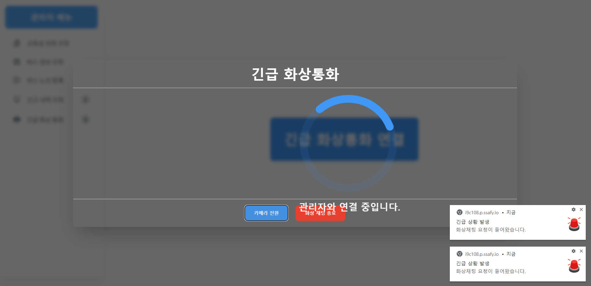 |

### 3.6. 셔틀버스 신고 조회  

|                   셔틀버스 신고 조회 화면                    |
| :----------------------------------------------------------: |
| 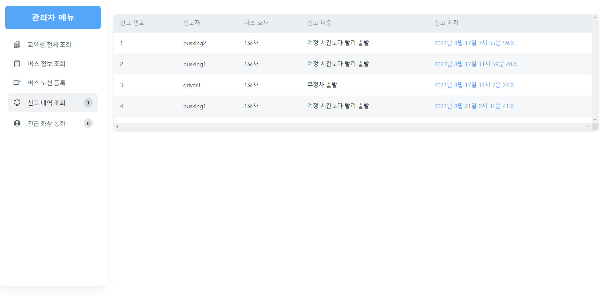 |